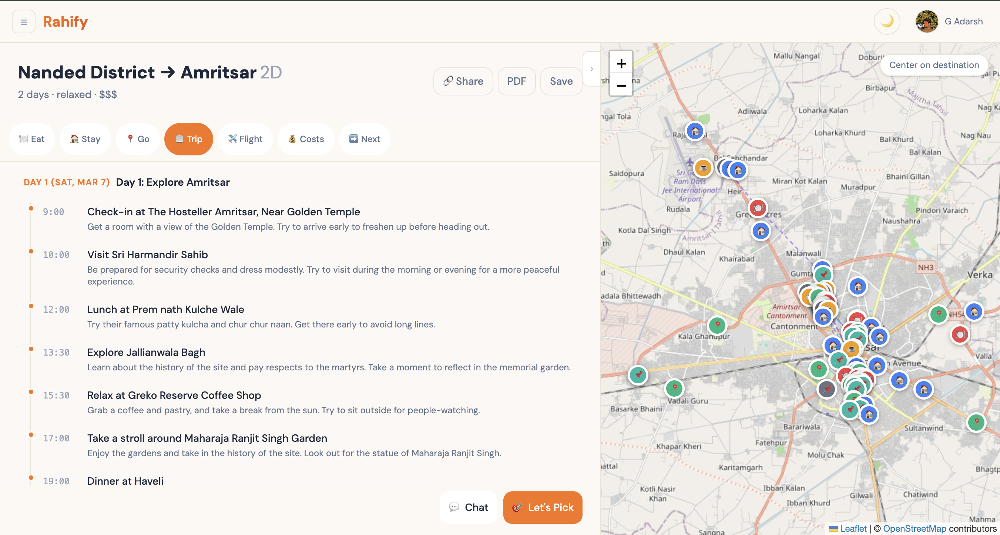

## 🌍 Rahify — AI-Powered Travel Planner

Enter trip details → get personalized itineraries with real places, real flights, cost quotes, and a downloadable trip document.

**Badges**

- **Live:** `rahify.com`
- **Stack:** React · FastAPI · Supabase
- **License:** Private (for now)



---

## What Makes Rahify Different

- **Approach A — places first:** Rahify fetches real Google Places data **before** asking the AI to plan, so every suggestion starts from verified places.
- **Zero hallucination focus:** Real photos, ratings, addresses, and Maps links from second one, not invented venues.
- **Structured, not chatty:** A full plan view with tabs, timelines, and an interactive map — not just a chat transcript.
- **Grounded travel data:** Real flight options via SerpAPI, formula-based costs from actual place data, and visa/essentials guidance that reads your exact itinerary.

---

## Features

| Area | Highlights |
|------|------------|
| **Input Flow** | 10-step conversational trip input on the home page (public, no login required to explore). |
| **Itinerary** | AI-generated, day-by-day timeline with narrative plus structured activities. |
| **Plan Tabs** | 7 tabs: **Eat**, **Stay**, **Go**, **Flights**, **Costs**, **Trip Timeline**, **What’s Next**. |
| **Map** | Interactive Leaflet + OpenStreetMap panel with color-coded markers by category and route lines. |
| **AI Chat** | Context-aware chat to tweak the itinerary (swap places, adjust pace, change days). |
| **Let’s Pick** | Full-screen selector to include/exclude places and add custom URLs before regenerating. |
| **Flights** | Real flight data via SerpAPI with Skyscanner and Google Flights deep links and “Best/Cheapest/Fastest” badges. |
| **Costs** | Cost breakdown (accommodation, food, activities, transport) with 150+ currencies and live FX rates. |
| **Sharing** | Share trips via invite code, with viewer suggestions and ability to fork into their own plan. |
| **PDF** | Rahify-branded PDF export: itinerary, costs, visa info, packing checklist, phrases, and essentials. |
| **Appearance** | Dark/light mode with a warm, editorial feel. |
| **PWA** | Installable PWA (Add to Home Screen) with mobile-first layout. |
| **Right Now** | “Right Now” modal for nearby places based on live location (eat / stay / go). |

---

## Tech Stack

| Layer | Technology | Notes |
|-------|------------|-------|
| **Frontend** | React 18, Vite, Tailwind CSS v4, Zustand | SPA hosted on Netlify, mobile-first, custom onboarding tour. |
| **Backend** | Python 3.12, FastAPI | Async API with SSE for generation, chat, and picks. |
| **Database/Auth** | Supabase (PostgreSQL + Auth + Storage) | Google OAuth only, RLS-guarded trip and profile data. |
| **AI** | Groq (Llama 3 70B), model-agnostic wrapper | Designed to swap to Claude easily without touching the frontend. |
| **Maps** | Leaflet + OpenStreetMap | Free, no API key for map tiles. |
| **Places** | Google Places API (New) | Real place data, photos, ratings, opening hours, deduplicated and sorted by budget tier. |
| **Flights** | SerpAPI (Google Flights) | Cached flight search with 10‑minute cooldown. |
| **Geocoding** | Photon (Komoot) | Free, worldwide geocoding for maps and “Right Now”. |
| **PDF** | ReportLab | Server-side PDF generation with Rahify branding. |
| **Analytics** | PostHog | Frontend event tracking + session replay, disabled in local dev. |
| **Hosting** | Netlify (frontend), Railway (backend), Supabase (DB) | Domain managed on Porkbun at `rahify.com`. |

---

## Architecture

High-level data flow:

```text
Frontend (React SPA on Netlify)
        ↓  HTTPS + SSE
FastAPI Backend (Railway)
        ↓
Supabase (PostgreSQL + Auth + Storage)

External services:
  ↕ Google Places API (real places, photos)
  ↕ Groq / LLM provider (itinerary + insights)
  ↕ SerpAPI (Google Flights)
  ↕ Photon (geocoding)
  ↕ PostHog (analytics)
```

---

## Getting Started (Local Development)

### Prerequisites

- Node.js **18+**
- Python **3.12+**
- Supabase project (URL + anon/service keys)

### Frontend

```bash
cd frontend
npm install
cp .env.example .env.development  # fill in keys
npm run dev
```

### Backend

```bash
cd backend
pip install -r requirements.txt
cp .env.example .env  # fill in keys
uvicorn app.main:app --reload --port 8000
```

### Environment Variables (names only)

**Frontend**

- `VITE_SUPABASE_URL`
- `VITE_SUPABASE_ANON_KEY`
- `VITE_API_URL`
- `VITE_POSTHOG_KEY`
- `VITE_POSTHOG_HOST`

**Backend**

- `GROQ_API_KEY`
- `GOOGLE_PLACES_API_KEY`
- `SERPAPI_KEY`
- `SUPABASE_URL`
- `SUPABASE_SERVICE_KEY`

Refer to the `.env.example` files in `frontend/` and `backend/` for the full set of configuration options.

---

## Project Structure

```text
rahify/
├── frontend/          React + Vite + Tailwind
│   └── src/
│       ├── components/  UI components
│       ├── pages/       Route pages
│       ├── stores/      Zustand stores
│       ├── services/    API + Supabase + PostHog
│       └── hooks/       Custom hooks
├── backend/           FastAPI + Python
│   └── app/
│       ├── routes/     API endpoints
│       ├── services/   Business logic
│       └── prompts/    AI prompt templates
├── CLAUDE.md          AI coding context
├── PROJECT_SPEC.md    Full product spec
└── MWEB_UI_SPEC.md    Mobile UI spec
```

---

## Deployment

- **Frontend:** Auto-deploys to Netlify on push to `master`.
- **Backend:** Auto-deploys to Railway on push to `master` (Dockerized FastAPI app).
- **Database:** Supabase cloud instance (managed PostgreSQL with RLS).
- **Domain:** `rahify.com` via Porkbun DNS, pointing to Netlify + Railway.

---

## Roadmap

- **V2:** Multi-destination trips, community-published trips, collaborative group editing.
- **V3:** Capacitor-based mobile apps (iOS + Android) with push notifications.
- **V4:** Booking engine integrations, live trip monitoring, expense splitting.
- **V5:** AR previews of places and a white-label planning API.

---

## Credits

Built by **Adarsh Gella** — solo developer, AI-assisted.  
`rahify.com` · `adarsh@rahify.com`

